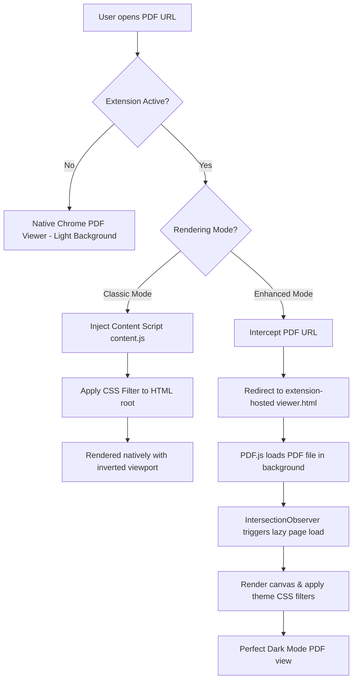

# PDF Dark Mode Chrome Extension

A highly polished, premium browser extension that adds customizable dark mode themes to PDF documents viewed directly in Google Chrome.

## Features

- **Double Rendering Modes**:
  - **Classic Mode**: Lightweight CSS color inversion running directly on Chrome's native PDFium viewer.
  - **Enhanced Mode**: Full page rendering using Mozilla's **PDF.js** engine, inverting page colors while preserving the viewer UI, keeping scrollbars, toolbars, and background beautifully dark.
- **Multiple Color Themes**:
  - **Dark**: High-contrast, clean dark theme.
  - **Warm**: Soft dark theme with an amber/sepia tint to reduce eye strain.
  - **Cool**: Modern deep slate blue dark theme.
  - **Sepia**: Vintage book paper tone (perfect for daytime reading).
  - **Mono**: Sleek black & white grayscale inversion.
- **Fine-grained Adjustments**: Control brightness, contrast, and grayscale levels via smooth sliders.
- **Lazy Page Rendering**: Features an `IntersectionObserver` that only renders PDF pages as they scroll into view, keeping memory usage extremely low.
- **Persistent Storage**: Remembers your active theme, rendering mode, and custom sliders using `chrome.storage.local`.
- **Easy Native Exit**: One-click to view the PDF in its original, unaltered form.

---

## Installation Guide

### Step 1: Open Chrome Extensions
1. In Google Chrome, navigate to `chrome://extensions/` by typing it in your address bar.
2. In the top-right corner, toggle the **"Developer mode"** switch to **ON**.

### Step 2: Load the Extension
1. Click the **"Load unpacked"** button in the top-left corner.
2. Select the extension directory: `C:\src\pdf-dark`.
3. The **PDF Dark Mode** extension will appear in your extension list!

### Step 3: Enable Local File Access (CRITICAL)
If you view local PDFs (i.e. files stored on your hard drive with URLs starting with `file:///`), Chrome blocks extensions from accessing them by default.
1. Locate the **PDF Dark Mode** card in `chrome://extensions/`.
2. Click the **"Details"** button.
3. Scroll down to find the **"Allow access to file URLs"** toggle and switch it **ON**.

---

## Architecture Diagram

The diagram below illustrates how PDF Dark Mode intercepts and styles PDFs dynamically:

## Setup & File Dependencies

This project is fully packaged and includes the local build files for PDF.js to comply with Chrome Manifest V3 security rules (no remote scripts allowed).

- `pdfjs/pdf.js`: Core PDF.js library.
- `pdfjs/pdf.worker.js`: Worker thread for rendering PDFs.
- `icons/`: High-resolution extension assets.

*The setup script `setup.js` can be executed using `node setup.js` to refresh these assets from CDNjs if needed.*

## Technical details
- **Manifest Version**: 3
- **APIs Used**: `chrome.storage`, `chrome.scripting`, `chrome.tabs`, `chrome.runtime`, `chrome.extension`
- **Observer**: `IntersectionObserver` for virtualized lazy page rendering
- **Styles**: Custom CSS variables, responsive sliders, glassmorphism UI in settings
