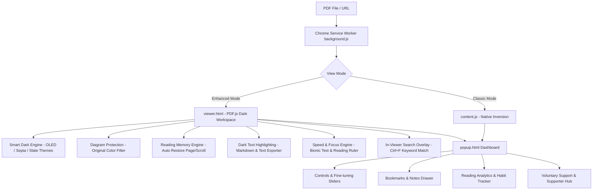

# Portable Darkument Format (PDF Dark Mode)

> **The S-Tier PDF Reading & Productivity Workspace for Google Chrome.**  
> Transform your PDF reading experience with zero eye strain, zero white screen flashes, smart diagram color protection, Bionic speed reading, and habit-building reading analytics — **100% free & open-source**.

---

## ✨ Features at a Glance

| Feature Module | Capabilities |
| :--- | :--- |
| **🌙 Smart Dark Engine** | 5 color themes (OLED Pure Black, Sepia Amber, Slate Blue, Mono Contrast, Classic Invert) + Brightness, Contrast & Grayscale sliders. |
| **🖼️ Diagram Protection** | Automatically detects images, charts, and SVG diagrams to preserve their natural original colors instead of creating harsh inverted negatives. |
| **📌 Reading Memory** | Remembers scroll position, page number, and zoom ratio for every PDF. Returns instantly to where you left off. |
| **🧠 Bionic Reading** | Emphasizes initial characters of words for faster speed-reading and laser focus on dense papers. |
| **📏 Reading Ruler** | Movable semi-transparent focus bar following mouse cursor to prevent line skips. |
| **🖍️ Neon Highlighting** | Neon text highlighting (Amber, Cyan, Mint, Rose) with notes. 1-click export to Markdown (`.md`), Plain Text (`.txt`), or Full Document Text (`.txt`). |
| **🔍 Find-In-Page Overlay** | In-viewer search bar (`Ctrl+F`) with match counter (`3 / 15`) and Enter/Shift+Enter navigation. |
| **🔥 Reading Analytics** | Tracks daily reading time, pages read, and maintains an active reading streak counter ("🔥 7 Day Streak"). |
| **💾 Backup & Restore** | 1-click JSON import/export for all settings, bookmarks, and highlights. |
| **🌐 Multi-Language (i18n)** | One-click language selector for English and Traditional Chinese (繁體中文). |

---

## 🏛️ System Architecture

---

## ⚡ Global Keyboard Shortcuts

| Shortcut | Action |
| :--- | :--- |
| <kbd>Alt + Shift + D</kbd> | Toggle PDF Dark Mode ON / OFF |
| <kbd>Alt + Shift + B</kbd> | Toggle Bionic Speed Reading Mode |
| <kbd>Alt + Shift + R</kbd> | Toggle Reading Ruler Line Focus Guide |
| <kbd>Ctrl + F</kbd> / <kbd>Cmd + F</kbd> | Open Dark Find-In-Page Search Bar |
| <kbd>J</kbd> / <kbd>K</kbd> | Smooth Next Page / Previous Page Navigation |

---

## 🚀 Quick Installation Guide

### Step 1: Open Chrome Extensions
1. In Google Chrome or Microsoft Edge, navigate to `chrome://extensions` or `edge://extensions`.
2. Enable **"Developer mode"** in the top-right corner.

### Step 2: Load Unpacked Extension
1. Click **"Load unpacked"**.
2. Select this directory: `C:\src\pdf-dark`.

### Step 3: Enable Local File Access (CRITICAL)
If you read local PDF files stored on your hard drive (`file:///` URLs):
1. Click **"Details"** under **PDF Dark Mode** in `chrome://extensions`.
2. Scroll down and toggle **"Allow access to file URLs"** to **ON**.

---

## ☕ Voluntary Donation & Supporter Model

PDF Dark Mode is **100% free and open-source** with zero ads, zero paywalls, and zero tracking.

If PDF Dark Mode helps your daily reading, study, or research, consider supporting development:
- ☕ **[Buy Me a Coffee](https://buymeacoffee.com)**
- 💖 **[GitHub Sponsors](https://github.com/sponsors)**
- ❤️ **[Ko-fi](https://ko-fi.com)**
- 💳 **[PayPal](https://paypal.me)**

*Supporters can optionally unlock the "Supporter Badge ❤️" and Gold Accent Theme in extension settings!*

---

## 🧪 Automated Testing & Quality

This codebase is verified by an automated 4-tier test runner (`node tests/run-tests.js`):

- **Tier 1 (Feature Coverage)**: 53 / 53 Passed (100%)
- **Tier 2 (Boundary & Corner Cases)**: 46 / 46 Passed (100%)
- **Tier 3 (Cross-Feature Combinations)**: 15 / 15 Passed (100%)
- **Tier 4 (Real-World Workloads)**: 8 / 8 Passed (100%)

**Total: 122 / 122 Automated Tests Passed.**
